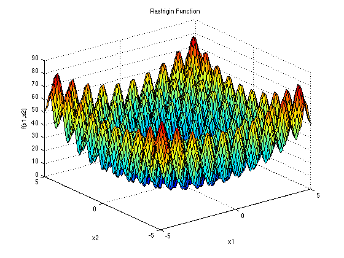

# Wprowadzenie

## Cel i zakres projektu:

Celem projektu jest przeprowadzenie statystycznego porównania działania wybranych algorytmów minimalizacji stochastycznej. Do porównania wybraliśmy:

-   Pure Random Search (PRS)
-   Algorytm Genetyczny (GA).

Porównanie odbywa się na dwóch funkcjach z pakietu smoof, dla różnych liczby wymiarów (2, 10 i 20), co daje łącznie 6 przypadków testowych. Wybraliśmy poniższe funkcje:

-   Rosenbrock
-   Rastrigin

## Opis algorytmów stochastycznych

### Pure Random Search (PRS)

Pure Random Search (PRS) to prosty algorytm minimalizacji stochastycznej, w którym losujemy zadaną liczbę punktów z rozkładem jednostajnym w określonej dziedzinie. W każdym kroku algorytmu generowany punkt jest porównywany z dotychczas znalezionym minimum. Jeśli wartość funkcji minimalizowanej w nowo wylosowanym punkcie jest mniejsza niż wartość w dotychczasowym minimum, nowy punkt zostaje zapisany jako aktualne minimum. Proces ten trwa do wyczerpania określonego budżetu, którym jest liczba wywołań funkcji celu. PRS charakteryzuje się prostotą implementacji, jednak jego skuteczność jest ograniczona w przypadku bardziej złożonych funkcji, ponieważ nie wykorzystuje on żadnych informacji o strukturze przestrzeni poszukiwań.

### Algorytm Genetyczny (GA)

Algorytm Genetyczny (GA) to metaheurystyczny algorytm minimalizacji, inspirowany procesami ewolucji biologicznej, takimi jak selekcja naturalna, rekombinacja (krzyżowanie) i mutacja. Proces rozpoczyna się od wygenerowania początkowej populacji osobników (punktów w przestrzeni poszukiwań). Każdy osobnik reprezentuje potencjalne rozwiązanie, którego jakość oceniana jest za pomocą funkcji celu. W kolejnych iteracjach algorytmu populacja ewoluuje poprzez wybór osobników o najlepszej wartości funkcji celu, ich rekombinację w celu generowania nowego potomstwa oraz wprowadzenie mutacji, aby zwiększyć różnorodność rozwiązań. Proces ewolucji trwa do wyczerpania budżetu, określonego przez liczbę wywołań funkcji celu. Algorytmy genetyczne są szczególnie efektywne w problemach złożonych i nieliniowych, ponieważ potrafią eksplorować przestrzeń rozwiązań w sposób globalny, unikając lokalnych minimów. W projekcie GA został zaimplementowany przy użyciu pakietu GA, z powodu utrudnionego dostępu do wyznaczone biblioteki ECR na systemie Linux.

## Opis funkcji testowych

### Rosenbrock

Funkcja Rosenbrocka, znana jako "dolina Rosenbrocka", jest popularnym benchmarkiem w optymalizacji. Jej globalne minimum wynosi 0 i znajduje się w punkcie (1,1,...,1). Funkcja charakteryzuje się wąską, zakrzywioną doliną, co utrudnia szybkie znalezienie globalnego minimum. Definicja funkcji w $n$-wymiarach to:

::: {.center}
{width=60%}
:::

$$
f(x) = \sum_{i=1}^{n-1} \left[ 100 \cdot (x_{i+1} - x_i^2)^2 + (1 - x_i)^2 \right]
$$ Ze względu na swoją strukturę, jest używana do oceny wydajności algorytmów w trudnych problemach optymalizacyjnych.

\pagebreak
### Rastrigin

Funkcja Rastrigina to popularny benchmark w optymalizacji globalnej, charakteryzujący się wieloma lokalnymi minimami. Jej globalne minimum wynosi 0 i znajduje się w punkcie (0,0,…,0). Jest definiowana w $n$-wymiarach jako:

::: {.center}
{width=60%}
:::

$$
f(x) = 10n + \sum_{i=1}^n \left[x_i^2 - 10\cos(2\pi x_i)\right]
$$

Ze względu na swoją oscylacyjną strukturę, jest wyzwaniem dla algorytmów optymalizacyjnych, które muszą unikać lokalnych minimów.

<!-- \pagebreak -->
# Wyniki pomiarów

```{r include=FALSE, warning=FALSE, message=FALSE}
library(smoof)
library(ggplot2)
library(dplyr)
library(GA)

ra2GA <- as.vector(read.csv("./data/rastrigin_2dGA.csv"))$x
ra2PRS <- as.vector(read.csv("./data/rastrigin_2dPRS.csv"))$x
ra10GA <- as.vector(read.csv("./data/rastrigin_10dGA.csv"))$x
ra10PRS <- as.vector(read.csv("./data/rastrigin_10dPRS.csv"))$x
ra20GA <- as.vector(read.csv("./data/rastrigin_20dGA.csv"))$x
ra20PRS <- as.vector(read.csv("./data/rastrigin_20dPRS.csv"))$x
rb2GA <- as.vector(read.csv("./data/rosenbrock_2dGA.csv"))$x
rb2PRS <- as.vector(read.csv("./data/rosenbrock_2dPRS.csv"))$x
rb10GA <- as.vector(read.csv("./data/rosenbrock_10dGA.csv"))$x
rb10PRS <- as.vector(read.csv("./data/rosenbrock_10dPRS.csv"))$x
rb20GA <- as.vector(read.csv("./data/rosenbrock_20dGA.csv"))$x
rb20PRS <- as.vector(read.csv("./data/rosenbrock_20dPRS.csv"))$x

results <- read.csv("./data/results.csv")

generate_plot <- function(data, function_name, algorithm_name) {
  median_value <- median(data)
  iqr_value <- IQR(data)
  lower_quantile <- quantile(data, 0.25)
  upper_quantile <- quantile(data, 0.75)  

  filtered_data <- data[data >= (lower_quantile - 1.5 * iqr_value) & data <= (upper_quantile + 1.5 * iqr_value)]
  
  bin_width <- diff(range(filtered_data)) / 30
  
  ggplot(data.frame(Value = filtered_data), aes(x = Value)) +
  geom_histogram(binwidth = bin_width, fill = "blue", color = "black", alpha = 0.5) +
  
  geom_vline(aes(xintercept = min(filtered_data), color = "Minimum"), linewidth = 1) +
  geom_vline(aes(xintercept = mean(filtered_data), color = "Mean"), linetype = "dashed") +
  
  labs(
    title = paste(function_name, algorithm_name),
    x = "Values",
    y = "Count",
    color = "Legend"
  ) +
  
  scale_color_manual(values = c("Minimum" = "green", "Mean" = "red")) +

  scale_x_continuous(limits = c(0, max(filtered_data))) +
  
  theme_minimal() +
  theme(plot.title = element_text(hjust = 0.5))
}
```

## Funkcja Rosenbrock_2d

### GA

-   Średnia: `r mean(rb2GA)`
-   Wartość najmniejsza: `r min(rb2GA)`
-   Wartość największa: `r max(rb2GA)`
-   Mediana: `r median(rb2GA)`
-   Dolny kwartyl: `r quantile(rb2GA, 0.25)`
-   Górny kwartyl: `r quantile(rb2GA, 0.75)`

### PRS

-   Średnia: `r mean(rb2PRS)`
-   Wartość najmniejsza: `r min(rb2PRS)`
-   Wartość największa: `r max(rb2PRS)`
-   Mediana: `r median(rb2PRS)`
-   Dolny kwartyl: `r quantile(rb2PRS, 0.25)`
-   Górny kwartyl: `r quantile(rb2PRS, 0.75)`

## Funkcja Rosenbrock_10d

### GA

-   Średnia: `r mean(rb10GA)`
-   Wartość najmniejsza: `r min(rb10GA)`
-   Wartość największa: `r max(rb10GA)`
-   Mediana: `r median(rb10GA)`
-   Dolny kwartyl: `r quantile(rb10GA, 0.25)`
-   Górny kwartyl: `r quantile(rb10GA, 0.75)`

### PRS

-   Średnia: `r mean(rb10PRS)`
-   Wartość najmniejsza: `r min(rb10PRS)`
-   Wartość największa: `r max(rb10PRS)`
-   Mediana: `r median(rb10PRS)`
-   Dolny kwartyl: `r quantile(rb10PRS, 0.25)`
-   Górny kwartyl: `r quantile(rb10PRS, 0.75)`

## Funkcja Rosenbrock_20d

### GA

-   Średnia: `r mean(rb20GA)`
-   Wartość najmniejsza: `r min(rb20GA)`
-   Wartość największa: `r max(rb20GA)`
-   Mediana: `r median(rb20GA)`
-   Dolny kwartyl: `r quantile(rb20GA, 0.25)`
-   Górny kwartyl: `r quantile(rb20GA, 0.75)`

### PRS

-   Średnia: `r mean(rb20PRS)`
-   Wartość najmniejsza: `r min(rb20PRS)`
-   Wartość największa: `r max(rb20PRS)`
-   Mediana: `r median(rb20PRS)`
-   Dolny kwartyl: `r quantile(rb20PRS, 0.25)`
-   Górny kwartyl: `r quantile(rb20PRS, 0.75)`

## Funkcja Rastrigin_2d

### GA

-   Średnia: `r mean(ra2GA)`
-   Wartość najmniejsza: `r min(ra2GA)`
-   Wartość największa: `r max(ra2GA)`
-   Mediana: `r median(ra2GA)`
-   Dolny kwartyl: `r quantile(ra2GA, 0.25)`
-   Górny kwartyl: `r quantile(ra2GA, 0.75)`

### PRS

-   Średnia: `r mean(ra2PRS)`
-   Wartość najmniejsza: `r min(ra2PRS)`
-   Wartość największa: `r max(ra2PRS)`
-   Mediana: `r median(ra2PRS)`
-   Dolny kwartyl: `r quantile(ra2PRS, 0.25)`
-   Górny kwartyl: `r quantile(ra2PRS, 0.75)`

## Funkcja Rastrigin_10d

### GA

-   Średnia: `r mean(ra10GA)`
-   Wartość najmniejsza: `r min(ra10GA)`
-   Wartość największa: `r max(ra10GA)`
-   Mediana: `r median(ra10GA)`
-   Dolny kwartyl: `r quantile(ra10GA, 0.25)`
-   Górny kwartyl: `r quantile(ra10GA, 0.75)`

### PRS

-   Średnia: `r mean(ra10PRS)`
-   Wartość najmniejsza: `r min(ra10PRS)`
-   Wartość największa: `r max(ra10PRS)`
-   Mediana: `r median(ra10PRS)`
-   Dolny kwartyl: `r quantile(ra10PRS, 0.25)`
-   Górny kwartyl: `r quantile(ra10PRS, 0.75)`

## Funkcja Rastrigin_20d

### GA

-   Średnia: `r mean(ra20GA)`
-   Wartość najmniejsza: `r min(ra20GA)`
-   Wartość największa: `r max(ra20GA)`
-   Mediana: `r median(ra20GA)`
-   Dolny kwartyl: `r quantile(ra20GA, 0.25)`
-   Górny kwartyl: `r quantile(ra20GA, 0.75)`

### PRS

-   Średnia: `r mean(ra20PRS)`
-   Wartość najmniejsza: `r min(ra20PRS)`
-   Wartość największa: `r max(ra20PRS)`
-   Mediana: `r median(ra20PRS)`
-   Dolny kwartyl: `r quantile(ra20PRS, 0.25)`
-   Górny kwartyl: `r quantile(ra20PRS, 0.75)`

\pagebreak
# Histogramy obrazujące rozkład znalezionych minimów funkcji

### Funkcja Rosenbrocka

```{r echo=FALSE, out.height="45%", warning=FALSE, message=FALSE}
generate_plot(rb2GA,"rosenbrock_2d","GA")
```

```{r echo=FALSE, out.height="45%", warning=FALSE, message=FALSE}
generate_plot(rb2PRS,"rosenbrock_2d","PRS")
```

```{r echo=FALSE, out.height="45%", warning=FALSE, message=FALSE}
generate_plot(rb10GA,"rosenbrock_10d","GA")
```

```{r echo=FALSE, out.height="45%", warning=FALSE, message=FALSE}
generate_plot(rb10PRS,"rosenbrock_10d","PRS")
```

```{r echo=FALSE, out.height="45%", warning=FALSE, message=FALSE}
generate_plot(rb20GA,"rosenbrock_20d","GA")
```

```{r echo=FALSE, out.height="45%", warning=FALSE, message=FALSE}
generate_plot(rb20PRS,"rosenbrock_20d","PRS")
```

### Funkcja Rastrigina

```{r echo=FALSE, out.height="45%", warning=FALSE, message=FALSE}
generate_plot(ra2GA,"rastrigin_2d","GA")
```

```{r echo=FALSE, out.height="45%", warning=FALSE, message=FALSE}
generate_plot(ra2PRS,"rastrigin_2d","PRS")
```

```{r echo=FALSE, out.height="45%", warning=FALSE, message=FALSE}
generate_plot(ra10GA,"rastrigin_10d","GA")
```

```{r echo=FALSE, out.height="45%", warning=FALSE, message=FALSE}
generate_plot(ra10PRS,"rastrigin_10d","PRS")
```

```{r echo=FALSE, out.height="45%", warning=FALSE, message=FALSE}
generate_plot(ra20GA,"rastrigin_20d","GA")
```

```{r echo=FALSE, out.height="45%", warning=FALSE, message=FALSE}
generate_plot(ra20PRS,"rastrigin_20d","PRS")
```

# Wykresy pudełkowe

```{r echo = FALSE}


ggplot(results, aes(x = Function, y = Value, fill = Algorithm)) +
  geom_boxplot() +
  facet_wrap(~Function, scales = "free") +
  labs(title = "Porównanie algorytmów PRS i GA dla funkcji Rosenbrocka i Rastrigina",
       y = "Znalezione minima funkcji",
       x = "Funkcja i wymiar") +
  theme_minimal()
```


# Analiza statystyczna

## Test t-Studenta dla prób zależnych

### Założenia teoretyczne
1. **Hipoteza zerowa ($H_0$):**  
   $$
   \mu_{\text{PRS}} = \mu_{\text{GA}} 
   $$  
   Brak istotnej różnicy między średnimi wynikami

2. **Hipoteza alternatywna ($H_1$):**  
   $$ 
   \mu_{\text{PRS}} \neq \mu_{\text{GA}} 
   $$  
   Istnieje istotna różnica między średnimi

3. **Poziom istotności:**  
   $$
   \alpha = 0.05 
   $$

\pagebreak
### Wyniki testów

```{r, echo=TRUE}
  perform_test <- function(prs, ga) {
  test <- t.test(prs, ga, paired = TRUE)
  data.frame(
    Różnica = round(test$estimate, 2),
    CI_95 = paste0("[", round(test$conf.int[1], 1), ", ", round(test$conf.int[2], 1), "]"),
    p_value = ifelse(test$p.value < 0.00001, "< 0.00001", round(test$p.value, 6))
  )
}

results_table <- data.frame(
  Funkcja = c("Rosenbrock_2d", "Rosenbrock_10d", "Rosenbrock_20d",
              "Rastrigin_2d", "Rastrigin_10d", "Rastrigin_20d"),
  bind_rows(
    perform_test(rb2PRS, rb2GA),
    perform_test(rb10PRS, rb10GA),
    perform_test(rb20PRS, rb20GA),
    perform_test(ra2PRS, ra2GA),
    perform_test(ra10PRS, ra10GA),
    perform_test(ra20PRS, ra20GA)
  )
)

knitr::kable(
  results_table,
  col.names = c("Funkcja", "Różnica średnich", "95% CI", "p-value"),
  caption = "Podsumowanie wyników testów statystycznych",
  row.names = FALSE
)
```


### Interpretacja
1. **Wszystkie p-value < 0.00001** - Silne dowody przeciw $H_0$
2. **Różnice średnich dodatnie** - GA konsekwentnie lepszy
3. **Przedziały ufności** nie zawierają zera - Wyniki istotne praktycznie

\pagebreak
# Wnioski

1. **Przewaga GA** jest statystycznie istotna (p < 0.00001) we wszystkich testowanych przypadkach
2. **Wraz ze wzrostem wymiarowości** różnice między algorytmami rosną:
   - Rosenbrock 20D: GA lepszy średnio o `r round(mean(rb20PRS - rb20GA), 0)` jednostek
   - Rastrigin 20D: GA lepszy średnio o `r round(mean(ra20PRS - ra20GA), 0)` jednostek
3. **PRS** wykazuje większą wariancję wyników (szersze rozkłady)
4. Wyniki potwierdzają **skuteczność algorytmów ewolucyjnych** w problemach wysokowymiarowych